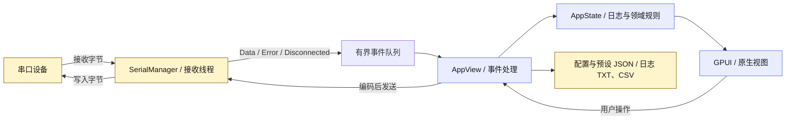

<a id="top"></a>

<div align="center">

# 🔌 串口调试助手

**SERIAL DEBUGGER · 原生桌面串口工作台**

连接设备，观察数据，复用命令。
<br />
面向设备联调与协议排查的纯 Rust / GPUI 工具。

[](./rust-toolchain.toml)
[](./Cargo.toml)
[](./Cargo.toml)

`原生渲染` · `ASCII / HEX / UTF-8 / GBK` · `循环发送` · `TXT / CSV 导出`

[快速开始](#quick-start) · [功能概览](#features) · [工程设计](#engineering) · [开发检查](#development) · [配置与排障](#configuration)

</div>

---

<table>
  <tr>
    <td width="33%" valign="top">
      <h3>🔌 连接与调试</h3>
      <p>枚举串口、调整通信参数，在悬浮连接台中完成设备连接。</p>
      <p><b>默认参数</b><br /><code>115200 · 8N1 · 无流控</code></p>
    </td>
    <td width="33%" valign="top">
      <h3>📡 观察与定位</h3>
      <p>实时日志、发送回显、HEX 显示与字节统计，配合专注日志视图。</p>
      <p><b>工作区设计</b><br />高对比 · 强层级 · 新野兽主义</p>
    </td>
    <td width="33%" valign="top">
      <h3>🧰 复用与留档</h3>
      <p>保存常用命令、按间隔循环发送，将联调记录导出为文本或表格。</p>
      <p><b>数据格式</b><br /><code>JSON 配置 · TXT / CSV 日志</code></p>
    </td>
  </tr>
</table>

<a id="quick-start"></a>

## 🚀 快速开始

准备 Rust stable；仓库的 `rust-toolchain.toml` 已声明 `rustfmt` 与 `clippy` 组件。

| 平台 | 构建前准备 |
| :--- | :--- |
| Windows | MSVC 工具链及对应的 C++ 构建工具、Windows SDK |
| Linux / macOS | GPUI 所需的系统图形依赖与平台开发工具 |

跨平台依赖信息可从 [GPUI 上游文档](https://github.com/zed-industries/zed/tree/main/crates/gpui)查阅；实际运行需在目标系统构建验证。

```bash
git clone https://github.com/pcsensor/serial.git
cd serial
cargo run --locked
```

**第一次联调**

1. 打开顶部连接台，选择或填写串口名称，设置与设备一致的通信参数。
2. 连接设备，选择编码与行尾，输入内容并发送。
3. 查看收发日志；按需开启 HEX 显示、自动滚动或“专注日志”。
4. 保存常用命令为预设，或使用“导出 TXT / CSV”保存本次记录。

> [!TIP]
> 默认通信参数为 **115200 / 8 数据位 / 1 停止位 / 无校验 / 无流控**。连接成功后仍需确认设备协议要求的编码与 CR、LF、CRLF 行尾。

<a id="features"></a>

## ✨ 功能概览

| 能力 | 已实现内容 | 使用场景 |
| :--- | :--- | :--- |
| 🔌 串口连接 | 端口枚举；波特率、数据位、停止位、校验位、流控配置 | 设备接入与参数对齐 |
| 🔤 多编码收发 | ASCII、HEX、UTF-8、GBK；可选无行尾、CR、LF、CRLF | 文本指令与二进制数据调试 |
| 📟 实时日志 | 接收日志、发送回显、HEX 显示、自动滚动、收发字节统计 | 观察设备响应与核对数据 |
| 🎯 专注工作区 | 悬浮连接台；“专注日志”收起发送区，“退出专注”恢复 | 长时间观察日志 |
| 🔁 循环发送 | 毫秒间隔配置；通过代际令牌使旧发送任务失效 | 重复指令与持续联调 |
| 🗂️ 命令预设 | 保存、加载命令，JSON 持久化 | 复用常见操作 |
| 📤 日志导出 | 系统保存对话框；TXT、CSV；CSV 标准字段转义与 UTF-8 BOM | 问题留档与 Excel 查看 |
| 🛠️ 异常反馈 | 设备断开、读写失败同步到界面；断开后停止循环发送 | 连接异常定位 |

<a id="engineering"></a>

## 🏗️ 工程设计

界面由 GPUI 原生渲染，控件基于 `gpui-component`。领域状态、串口通信与文件导出各自独立，便于测试数据规则和排查 I/O 问题。



### 🧱 运行边界

以下数值来自当前实现，用于理解资源约束与调试行为。

| 约束 | 当前实现 | 工程意义 |
| :--- | :--- | :--- |
| 日志条数 | 最多 `10,000` 条，超出后移除最旧记录 | 限制日志列表增长 |
| 未结束接收行 | 累积至 `64 KiB` 时分段 | 避免无换行数据持续扩大单行缓冲 |
| UI 事件队列 | 容量 `256`，满队列重试可被停止标志打断 | 接收背压与线程退出协作 |
| 串口 I/O | 读取超时 `100 ms`；写入重试期限 `2 s` | 读写失败进入错误处理流程 |
| 循环间隔 | 限制在 `1–86,400,000 ms`，默认 `1,000 ms` | 统一输入边界；实际调度受系统与 I/O 影响 |

> [!NOTE]
> 日志是有容量上限的内存记录。需要保留联调过程时，应及时导出；旧记录被移除后不会包含在后续导出中。

<details>
<summary><b>🔬 展开：数据处理与持久化细节</b></summary>

- **接收数据**：按 CR / LF 划分消息，识别跨读取边界的 CRLF；保留原始字节供 HEX 显示使用。
- **字符解码**：提供增量 UTF-8 解码；显示阶段对不合法字节采用替代字符，原始字节单独保留。
- **发送生命周期**：关闭连接或停止循环时更新代际令牌，旧任务在后续发送检查中失效。
- **配置保存**：串行化写入，先写临时文件再重命名替换；目标已存在时提供兼容替换分支。
- **CSV 导出**：通过 `csv` 库处理逗号、引号与换行，写入 UTF-8 BOM；字段为时间、方向、编码、数据。

</details>

### 🦀 技术栈

| 层 | 技术 | 职责 |
| :--- | :--- | :--- |
| 窗口与渲染 | [GPUI](https://github.com/zed-industries/zed/tree/main/crates/gpui) `0.2.2` | 原生桌面视图 |
| 控件 | [gpui-component](https://github.com/longbridge/gpui-component) `0.5.1` | 输入框、按钮与主题 |
| 串口 | [serialport](https://crates.io/crates/serialport) `4.9` | 端口枚举与串口读写 |
| 编码 | [encoding_rs](https://crates.io/crates/encoding_rs) `0.8` | 字符编码转换 |
| 事件通道 | `async-channel` | 接收线程与 UI 之间的有界事件传递 |
| 配置与导出 | `serde` · `serde_json` · `csv` · `dirs` · `rfd` | 序列化、配置路径与系统保存对话框 |

依赖声明见 [`Cargo.toml`](./Cargo.toml)，锁定版本见 [`Cargo.lock`](./Cargo.lock)。

<details>
<summary><b>🗺️ 展开：源码导航</b></summary>

```text
src/
├── main.rs                 # GPUI 应用入口
├── app.rs                  # 根视图、交互与生命周期
├── app/
│   └── view.rs             # 界面布局与工作区结构
├── state.rs                # 领域状态、接收分行与日志规则
├── serial/
│   ├── manager.rs          # 串口打开、接收线程、限时发送与清理
│   ├── encoding.rs         # 编解码与增量 UTF-8 解码
│   └── protocol.rs         # 串口事件模型
├── export/
│   ├── exporter.rs         # TXT / CSV 导出
│   └── persistence.rs      # 配置与预设持久化
└── ui/
    ├── theme.rs            # 语义色与原生控件主题
    └── components.rs       # 面板、徽章、标签与按钮变体
```

阅读入口：[应用交互](./src/app.rs) · [领域规则](./src/state.rs) · [串口管理](./src/serial/manager.rs) · [导出实现](./src/export/exporter.rs)

</details>

<a id="development"></a>

## 🧪 开发与构建

```bash
# 编译检查
cargo check --locked

# 单元测试
cargo test --all-targets --locked

# 格式与静态检查
cargo fmt --all -- --check
cargo clippy --locked --all-targets -- -D warnings

# 发布构建
cargo build --release --locked
```

产物位于 `target/release/`：Windows 为 `serial-debugger.exe`，其他平台为 `serial-debugger`。

现有测试覆盖接收分行、缓冲与日志上限、循环任务失效、编解码、串口参数校验和导出规则。硬件收发与窗口交互仍需结合目标设备人工验证。

<a id="configuration"></a>

## ⚙️ 配置与排障

串口参数与命令预设保存在系统配置目录下的 `serial-debugger/settings.json`。具体根目录由 `dirs::config_dir()` 决定；日志导出路径由系统保存对话框选择。

<details>
<summary><b>📁 配置内容与恢复行为</b></summary>

配置保存 `port_config` 与 `presets`，数据结构见 [`SavedSettings`](./src/export/persistence.rs)。首次启动且配置文件不存在时使用默认值；读取或解析失败时，应用使用默认配置并将错误提供给界面显示。

需要手动编辑配置时，先退出应用并备份原文件，避免后续自动保存覆盖修改。

</details>

<details>
<summary><b>🔎 常见联调问题</b></summary>

| 现象 | 检查方向 |
| :--- | :--- |
| 找不到串口或无法连接 | 检查设备连接、驱动、端口占用与当前用户的端口访问权限 |
| 能连接但没有响应 | 核对波特率、数据位、校验、停止位、流控及设备要求的行尾 |
| 文本乱码 | 核对编码；切换 HEX 显示检查原始字节 |
| 接收内容没有形成完整日志行 | 检查设备是否发送 CR / LF；未结束的数据保留在接收缓冲中 |
| 循环发送停止 | 查看连接状态与错误信息；设备断开会停止循环任务 |
| 导出后缺少早期记录 | 检查是否已超过内存日志条数上限，长时间联调请分段导出 |

</details>

---

<div align="center">

**Rust 驱动 · GPUI 原生渲染 · 面向设备联调**

[浏览源码](https://github.com/pcsensor/serial) · [反馈问题](https://github.com/pcsensor/serial/issues) · [返回顶部 ↑](#top)

</div>
